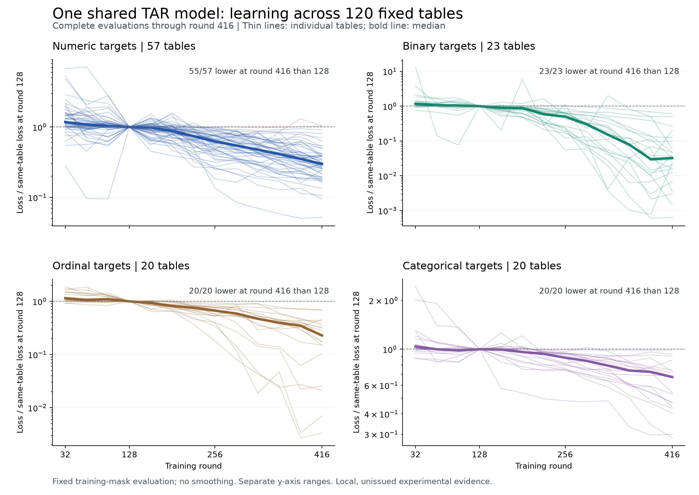

# TAR shared fitting: 120 tables and an experimental FP32 backend

This update records **local_unissued, fixed-training-table evidence**. A single
Small-128 model (1,267,136 parameters) learns across 120 heterogeneous synthetic
tables. At the captured run snapshot, training had reached round 437; the latest
complete all-table evaluation was round 416 (49,920 optimizer updates).

| Complete evaluation | Regression median NMSE (57 tables) | Discrete median accuracy (63 tables) | Discrete median NLL |
|---|---:|---:|---:|
| 128 | 0.607448 | 75.735% | 0.681855 |
| 256 | 0.275707 | 87.684% | 0.417930 |
| 384 | 0.145768 | 94.118% | 0.258611 |
| 416 | 0.112328 | 96.691% | 0.155884 |

At round 416, 118/120 table losses were below round 128, 115/120 below round 256,
and 91/120 below round 384. Over the six evaluation points from 256 to 416,
115/120 tables had a negative log-loss slope. These are descriptive comparisons,
not significance tests or evidence that every adjacent loss decreases.

Every thin line is one table; the bold line is the median of per-table loss
ratios. No smoothing or exclusion of unfavorable curves is applied. Panels use
separate logarithmic y-axis ranges.

## Protocol and interpretation

The four generator families contribute 48 mixed SCM, 48 DiscoSCM, 12 numeric SCM,
and 12 sklearn synthetic tables. Target types are numeric, binary, ordinal, and
categorical. Different random seeds are not independent mechanism families.

Each table has 256 rows: 204 training and 52 reserved. Every training update uses
all 204 training rows, with 136 visible response labels and 68 query labels.
Context/query assignments and nominal codebooks are resampled per episode. One
shared AdamW optimizer uses a constant learning rate of 1e-4, with one update per
table per shuffled round. There is no dataset-ID token.

All metrics above use the same eight fixed cyclic masks per table, covering all
204 training rows. Every all-table evaluation uses one shared model state. The
52 reserved rows are excluded from these training and evaluation forwards.
Pure-noise controls, absent support classes, and duplicate-query limits remain
in the data and objective. The results support broad joint trainability under
this recipe; unseen-world and real-table transfer remain separate questions.

## Code integrated in this update

- `small-128`, unified constant-weight value encoding, and encoder controls.
- Typed corpus freezing and shared multi-table fitting through the TAR CLI.
- Covering fit masks, per-update episode/input/codebook traces, periodic immutable
  checkpoints, and strict optimizer/source-bound segment resume.
- Explicit `numerical_backend="experimental_fp32"` for FP32 auxiliary arithmetic
  and MPS, with deterministic matrix forms for terminal row selection and PMFs.
  The default remains `reference_fp64`.

The reference precision name describes auxiliary preprocessing/gates/terminal
arithmetic; reference model parameters default to FP32. Experimental FP32 is not
a claim of full-domain numerical equivalence. MPS runs require a fresh process
with fallback and fast math disabled; the observed runtime was PyTorch 2.13.0.
Recorded MPS allocated/driver memory is end-state occupancy, not a peak.

A separate eight-table MPS run completed 1024 rounds / 8192 updates, with the
same original initialization and matched episode traces as the historical CUDA
run. Regression endpoint NMSE ranged from 0.001844 to 0.012076 and XOR accuracy
was 100%. See [backend comparison](eight-table-backend-comparison.json).
Historical CUDA timing is not a matched synchronized hardware-speed benchmark.

## Source and evidence identities

The 120-table measurements were produced by local frozen source revision
`d34f7d779617006d279b741fa698fb76e87b93d8`; the FP32/MPS eight-table source was
`a682ae3cb6e0bf1d08370500938628bbcb6f7562`. These are historical local identities,
not promises that those commits are reachable from the public repository.
This integration preserves current mainline compatibility fixes and therefore
has a **new source identity**. Published summaries are not newly issued receipts.
Historical checkpoints cannot be resumed under changed source hashes; use their
original source bundle or start a newly registered run. Identity checks are not
relaxed to make old checkpoints load.

This directory contains a scalar-only export of captured evaluation data,
per-table trends, figures, a plotting script and content checksums. Raw host
logs, credentials, machine identities and model/optimizer weights are not part
of this export. `summary.json` records the capture time. The historical run was
still running at capture; this is not a final 512-round result.

## Next research decisions

1. Preserve a predetermined endpoint and the full training trajectory as the
   shared-fitting baseline; do not choose checkpoints using reserved labels.
2. Freeze that model and evaluate all 52 reserved rows with all 204 training
   rows as context, then new worlds from the generator families, then a distinct
   real-table evaluation set. Compare random initialization, context-only
   baselines and shuffled-context controls under a fixed protocol.
3. Use the transfer results to prioritize world diversity, prior coverage or
   controlled model/data/budget expansion. Prepare a reproducible research
   narrative around the observed joint learning and the next falsifiable test.

These are planning directions, not authorization for additional compute or a
foundation-model capability claim.
